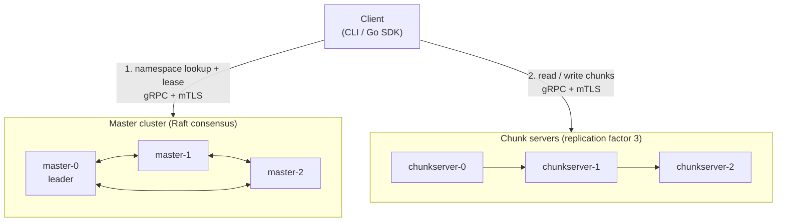

<div align="center">

# VaultFS

**A distributed filesystem built from first principles in Go.**

Content-addressed chunk storage, a custom Raft master cluster, lease-based write
coordination, mutual TLS, and first-class observability. Inspired by the Google
File System paper and built for correctness, durability, and operational clarity.

[](https://github.com/sumanthd032/vaultfs/actions/workflows/ci.yml)
[](https://pkg.go.dev/github.com/sumanthd032/vaultfs)
[](https://goreportcard.com/report/github.com/sumanthd032/vaultfs)
[](go.mod)
[](LICENSE)

[Quick Start](#quick-start) - [Architecture](#architecture) - [Usage](#usage) - [Deployment](#deployment) - [Documentation](#documentation)

</div>

---

## Overview

VaultFS spreads your data across many machines while presenting a single unified
namespace. Files are split into fixed-size chunks; every chunk is identified by
the SHA-256 of its contents and replicated three times across different nodes. A
Raft-based master cluster tracks where each chunk lives and coordinates writes
with time-bound leases. Clients read and write as though they were talking to a
single machine.

It is written from scratch, including the consensus layer, to be readable end to
end rather than gluing together existing libraries.

## Highlights

- **No data loss.** Every node fronts its storage with a write-ahead log and
  fsyncs before acknowledging a write.
- **No silent corruption.** Chunks are content-addressed by SHA-256 and verified
  on every read.
- **No single point of failure.** A three-node Raft master cluster elects a
  leader automatically and replicates the namespace through its log.
- **No split-brain writes.** A lease manager grants one primary per chunk for a
  bounded window, serializing mutations.
- **Secure by default.** Every connection between every component is mutually
  authenticated with TLS 1.3.
- **Observable out of the box.** Each daemon exports Prometheus metrics with a
  ready-made Grafana dashboard and alerting rules.

## Architecture



A write splits the file into chunks, asks a master where each chunk should live,
then streams the bytes through a replication chain of chunk servers. A read asks
a master for the chunk locations and pulls the data directly from the chunk
servers, verifying each SHA-256 on the way in. The master is never on the data
path.

Full design rationale lives in [docs/ARCHITECTURE.md](docs/ARCHITECTURE.md).

## Quick Start

Requires Go 1.26+ and Docker. Certificates are generated in pure Go, so no openssl is needed.

```bash
git clone https://github.com/sumanthd032/vaultfs.git
cd vaultfs

make certs    # generate the local development PKI
make dev      # build images and start the full cluster (masters, chunk servers, Prometheus, Grafana)
```

In another terminal, drive the cluster with the CLI. Because VaultFS is
GFS-style, clients talk to the chunk servers directly for data, so the CLI runs
inside the cluster network, the same way an application reaches VaultFS in
production. The repository root is mounted at `/work`:

```bash
alias vfs='docker compose -f deploy/docker-compose.yml run --rm cli'

vfs put /work/README.md /docs/readme.md
vfs ls  /docs
vfs get /docs/readme.md /work/out.md
vfs status
```

The `cli` service already has its master addresses and client certificate wired
through environment variables, so no flags are needed.

Open Grafana at [http://localhost:3000](http://localhost:3000) to watch the live
cluster dashboard.

## Usage

| Command | Description |
|---------|-------------|
| `vaultfs put <local> <remote>` | Chunk a file and write it with replication factor 3 |
| `vaultfs get <remote> <local>` | Fetch a file and verify every chunk |
| `vaultfs ls <path>` | List a directory in the namespace |
| `vaultfs rm <path>` | Delete a file |
| `vaultfs status` | Show the Raft leader, term, and known chunk servers |

Global flags: `--masters` (comma-separated addresses), `--timeout`, and the
`--cert` / `--key` / `--ca` mTLS material. Each also reads a `VAULTFS_*`
environment variable (`VAULTFS_MASTERS`, `VAULTFS_CERT`, and so on), so the same
binary is convenient on a host and inside a container.

### Go SDK

```go
import "github.com/sumanthd032/vaultfs/pkg/client"

c, err := client.New(client.Config{MasterAddrs: []string{"localhost:9000"}})
if err != nil {
    return err
}
defer c.Close()

if err := c.Put(ctx, "./local.txt", "/remote/local.txt"); err != nil {
    return err
}
```

Pass `client.Config.DialOptions` to dial the cluster over mTLS. See the
[package reference](https://pkg.go.dev/github.com/sumanthd032/vaultfs/pkg/client)
for the full API.

## Observability

Every master and chunk server exposes a Prometheus `/metrics` endpoint (masters
on `:9001`, chunk servers on `:9101`) reporting six metrics: operation counts,
WAL write latency, Raft elections, replication lag, missed heartbeats, and active
leases. The repository ships a Grafana dashboard and Prometheus alerting rules
under [`deploy/`](deploy), wired into both the Docker Compose stack and the
Kubernetes manifests.

## Deployment

### Local cluster (Docker Compose)

```bash
make certs
make dev
```

### Kubernetes

The manifests in [`deploy/k8s`](deploy/k8s) run the masters and chunk servers as
StatefulSets with stable network identities, persistent volumes, health probes,
and a Prometheus `ServiceMonitor`.

```bash
make certs
kubectl apply -k deploy/k8s
kubectl create secret generic vaultfs-certs -n vaultfs \
  --from-file=ca.crt=deploy/certs/ca.crt \
  --from-file=master.crt=deploy/certs/master.crt \
  --from-file=master.key=deploy/certs/master.key \
  --from-file=chunkserver.crt=deploy/certs/chunkserver.crt \
  --from-file=chunkserver.key=deploy/certs/chunkserver.key
```

## Tech Stack

| Area | Choice |
|------|--------|
| Language | Go 1.26 |
| RPC | gRPC and Protocol Buffers |
| Consensus | Custom Raft (election, log replication, snapshots) |
| Metadata store | BadgerDB |
| Security | Mutual TLS 1.3 (cert-manager ready) |
| Observability | Prometheus and Grafana |
| Local dev | Docker Compose |
| Production | Kubernetes (StatefulSets) |
| CI/CD | GitHub Actions, images published to GHCR |

Full rationale lives in [docs/TECH_STACK.md](docs/TECH_STACK.md).

## Development

```bash
make test          # run all tests with the race detector
make lint          # golangci-lint (zero issues required)
make proto         # regenerate protobuf from .proto files
make build         # build all binaries into bin/
make docker-build  # build all Docker images
```

```text
cmd/         CLI and node entry points (master, chunkserver, vaultfs)
internal/    Core library: wal, raft, clock, chunk, metadata, metrics, security
pkg/client/  Public Go SDK
proto/       gRPC service definitions
deploy/      Docker Compose, Kubernetes manifests, dashboards, alerting rules
docs/        Architecture, tech stack, and conventions
```

## Design Notes

**Why a custom Raft?** Reaching for `etcd/raft` would hide the most interesting
part of the system. The implementation is deliberately readable and documented so
it can serve as a reference.

**Why BadgerDB?** An embedded, Go-native LSM store with no external process fits
the master's metadata workload of frequent small reads and writes.

**Why StatefulSets?** Raft and the chunk map both depend on stable network
identities. Stable pod names mean a restarted node keeps its place in the cluster
without remapping.

**Why mTLS everywhere?** In a real distributed system every node must authenticate
every other node. Mutual TLS is the same model production systems such as
Kubernetes itself rely on.

## Contributing

Contributions are welcome. See [CONTRIBUTING.md](CONTRIBUTING.md) for local setup,
coding conventions, commit style, and the pull request checklist.

## License

Released under the MIT License. See [LICENSE](LICENSE).
